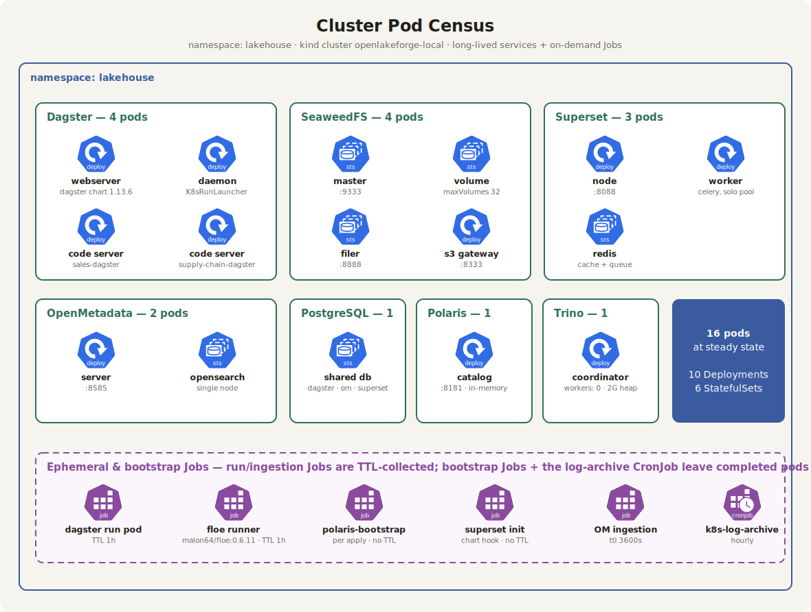
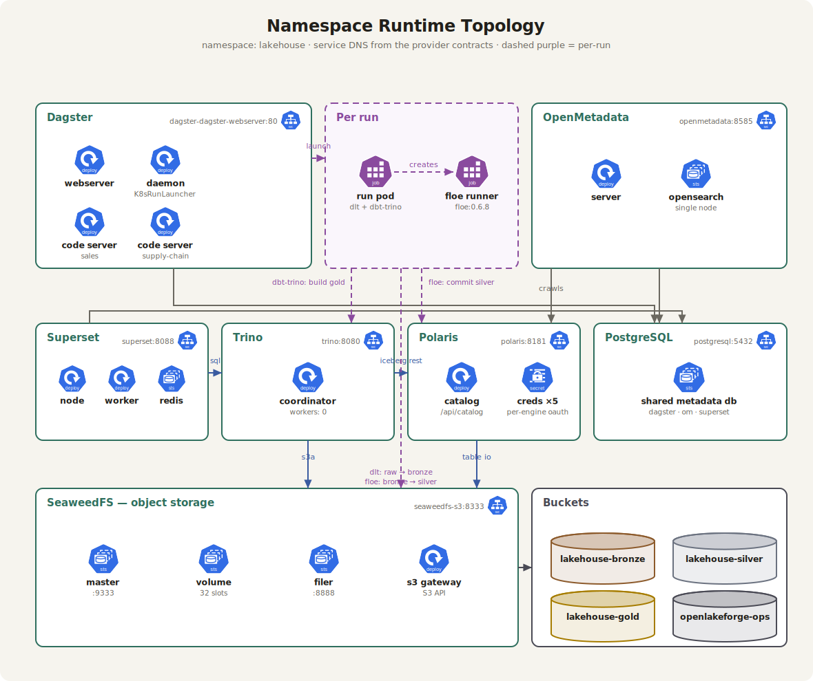
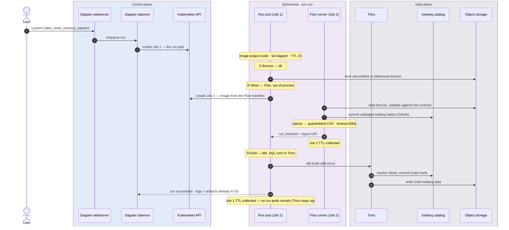
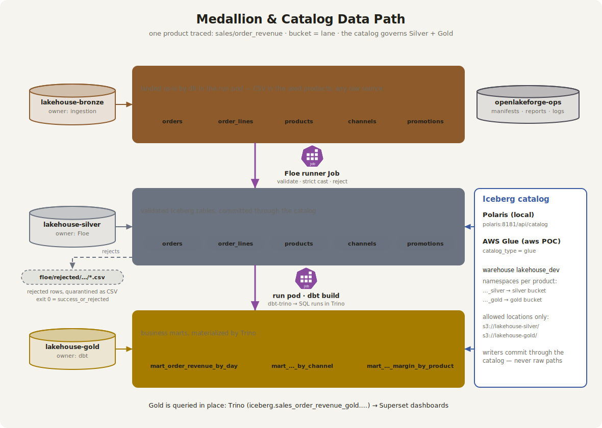
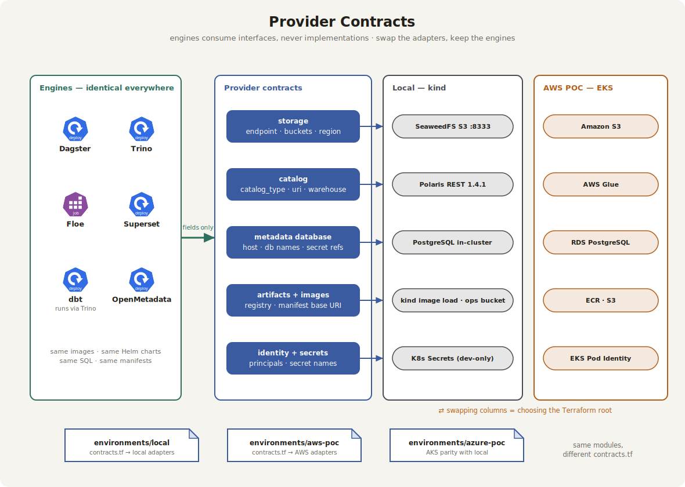

# OpenLakeForge — Architecture Charts

*How the platform is actually built, and how it actually runs — drawn the way Kubernetes
projects draw themselves.*

A cloud-agnostic, self-hostable lakehouse assembled on Kubernetes with Terraform and
Helm. Five charts in the official Kubernetes icon language: the pod-by-pod census, the
runtime wiring, the nested ephemeral jobs that do all data work, the medallion data
path, and the provider contracts that make the platform modular. They complement the
product chart in [../../assets/openlakeforge_v1.png](../../assets/openlakeforge_v1.png),
which shows *what* the platform does; these show *how*.

| **16** | **2** | **3** | **0** |
| --- | --- | --- | --- |
| pods at steady state — 10 Deployments, 6 StatefulSets | nested ephemeral Kubernetes Jobs per ingestion run | deployment targets sharing one contract — kind, AKS, EKS | run/Floe pods between runs (Gold runs in Trino) |

### Reading key — used identically in every chart

| Signal | Means |
| --- | --- |
| Blue heptagon icon | Kubernetes workload — the badge names the kind (`deploy`, `sts`, `svc`, `secret`) |
| **Purple icon / dashed purple border** | **Ephemeral** — created per run, garbage-collected on TTL |
| Green box | Long-lived service, grouped by Helm release |
| Blue box / badge | Control plane — Terraform, contracts, `olf` |
| Cylinder | Bucket or datastore; bronze / grey / amber follow the medallion layers |
| Orange | Managed service (AWS adapters) |

> Purple always means one thing: created for this run, deleted within the hour. The
> census shows that group empty — that is the point.

---

## Chart 1 — Cluster Pod Census

*Every pod in the namespace, grouped by service — verified with `helm template` against
this repo's own values.*

Sixteen pods at steady state: Dagster runs four (webserver, daemon, one code server per
domain), SeaweedFS four (three StatefulSets and an S3-gateway Deployment), Superset
three, OpenMetadata two, and PostgreSQL, Polaris, and Trino one each — Trino
deliberately coordinator-only. The purple group at the bottom is **empty between runs**:
every unit of data work is a Job that no longer exists an hour after it finished.



<sub>`infra/helm/values/local/*.yaml` · orchestration/dagster + storage/postgresql Terraform modules</sub>

## Chart 2 — Namespace Runtime Topology

*What talks to what — the service DNS on the wires is what consumers actually read from
the contracts.*

Superset queries Trino; Trino resolves tables through Polaris and reads data over s3a;
Polaris tracks catalog state in-memory (recreated by its bootstrap Job on restart) and
points at the Iceberg warehouse files in SeaweedFS; Dagster, OpenMetadata, and Superset share one
PostgreSQL. The per-run pair does the data work: the run pod lands raw data in
object storage with **dlt**, launches the **Floe** runner (which authenticates to
Polaris and reads/writes SeaweedFS), then calls **Trino** through dbt-trino to build
Gold.



<sub>[docs/architecture/local-stack-contracts.md](../local-stack-contracts.md) · `infra/terraform/modules/**`</sub>

## Chart 3 — Ephemeral Job Lifecycle

*Launch → run pod → nested Floe Job → Gold via Trino → everything garbage-collected.*

The differentiating behavior: the Dagster run pod is itself an ephemeral Job, and it
creates a *second* ephemeral Job for Floe from an image declared in the Floe manifest —
not in the Dagster deployment. Ingestion upgrades without rebuilding the orchestrator
image; failures isolate per entity; TTL returns the per-run footprint to zero (Gold SQL
executes in the standing Trino service, not a per-run pod).



> Observe it live: `kubectl -n lakehouse get jobs -w` — the run Job appears, then one
> Floe Job per entity while it is still Running, then all of them vanish an hour later.

Full detail — the per-engine execution table and the Job state machine — is in
**[chart3-ephemeral-job-lifecycle.md](chart3-ephemeral-job-lifecycle.md)**.

## Chart 4 — Medallion & Catalog Data Path

*Bucket = lane, and the Iceberg catalog governs Silver and Gold — one product traced end
to end.*

Raw data lands in Bronze as-is via dlt (CSV in the seed products, any raw source); the
Floe runner Job validates it against the contract and commits Silver Iceberg tables
through the catalog; dbt builds the Gold marts with the SQL executing **in Trino**
(dbt-trino). The catalog — Polaris locally, AWS Glue on the AWS POC — spans both curated
layers: per-product namespaces, allowed locations, and every write committed through it,
never to raw paths. Rejected rows are quarantined as CSV; exit code 0 covers
`success_or_rejected`.



<sub>environments/local/main.tf · catalog/polaris/main.tf · domains/sales/domain.yaml · ADR 0011, 0013</sub>

## Chart 5 — Provider Contracts

*Engines consume interfaces, never implementations — swap the adapters, keep the
engines.*

The modularity chart. Engines on the left are byte-identical in every deployment; the
contract spine in the middle is what they actually depend on (endpoint, buckets,
`catalog_type`, secret names); the columns on the right are interchangeable
implementations. Swapping a column is not a migration — it is choosing a Terraform root:
same modules, different `contracts.tf`.



<sub>`infra/terraform/environments/{local,aws-poc,azure-poc}/contracts.tf` · [provider-contracts.md](../provider-contracts.md) · ADR 0010, 0011, 0015, 0016</sub>

---

# Reference tables

*Comparisons and inventories — content that reads better as tables than as boxes.*

## Provider portability

| Contract | Local | Azure POC | AWS POC |
| --- | --- | --- | --- |
| Foundation | kind, 1 control-plane + 2 workers | AKS + ACR | VPC + EKS + node group + ECR |
| Object storage | SeaweedFS in-cluster | SeaweedFS on AKS | **S3** |
| Metadata database | PostgreSQL in-cluster | PostgreSQL in-cluster | **RDS PostgreSQL** |
| Iceberg catalog | Polaris REST | Polaris REST | **AWS Glue** |
| Container registry | kind image load | ACR | ECR |
| Workload identity | Kubernetes service account | AKS OIDC readiness | **EKS Pod Identity** — no static keys |
| Query + Gold engine | Trino | Trino | Trino |

`catalog_type` is the one field consumers branch on: `rest` selects the Polaris runtime
profile, `glue` the native Glue profile. Naming stays stable across Glue's two-level
model, so SQL and dbt models are unchanged. Not implemented (declared future adapters):
Keycloak, Vault/External Secrets, Traefik + cert-manager, Athena, Lake Formation, remote
Terraform state, OpenLineage ([ADR 0009](../../adr/0009-openmetadata-lineage-direct-rest-push.md)).

## Three-phase deploy — the CD boundary

Split by lifetime: each phase owns resources that change at a different pace, and a
domain commit triggers phase ③ only — CI never runs Terraform for domain changes
([ADR 0008](../../adr/0008-two-phase-deploy-infra-and-artifacts.md),
[ADR 0017](../../adr/0017-shared-python-deploy-tooling.md)).

| Phase | Target | Deploys |
| --- | --- | --- |
| ① Foundation | `make local-foundation-up` | Terraform: the Kubernetes cluster + container registry — kind locally, EKS + ECR on AWS, AKS + ACR on Azure |
| ② Platform | `make local-platform-up` | Terraform-driven Helm releases: SeaweedFS, PostgreSQL, Polaris, Trino, OpenMetadata, Superset, Dagster |
| ③ Artifacts | `make local-artifacts-deploy` | **the CD phase** — dynamic artifacts: the project-code image (dbt code), Floe contracts + manifests, Superset dashboards, OpenMetadata data products |

`make local-up` chains ① → ② → ③; ① and ② are idempotent no-ops when nothing changed.
Phase ③, in order: load contract env → compile Floe manifests → build + load
`project-code` → `olf artifacts upload-manifests` → `olf superset deploy-reports` →
`olf openmetadata deploy-metadata` → rollout-restart Dagster. CI runs five parallel
jobs: structure, infrastructure, contracts, project-code image build, tooling.

## Identity — one principal per engine

| Principal | Secret | Roles |
| --- | --- | --- |
| trino | `polaris-trino-creds` | data-engineer / catalog-admin |
| floe | `polaris-floe-creds` | data-writer / catalog-writer |
| openmetadata | `polaris-om-creds` | data-reader / catalog-reader |
| (root) | `polaris-bootstrap-credentials` | bootstrap Job only |

dbt has **no** Polaris principal — the bootstrap deletes the old `polaris-dbt-creds`;
Gold SQL runs in Trino, so Gold catalog access uses `polaris-trino-creds`. Plus
`seaweedfs-s3-creds` for object storage. A leaked writer credential cannot
administer the catalog. Delivery is Terraform → Kubernetes Secret →
`envSecrets`/`envFrom` into long-lived pods *and* ephemeral Jobs; the Trino catalog file
holds `${ENV:...}` placeholders, never literal secrets. The AWS POC replaces static
storage keys entirely with EKS Pod Identity
([ADR 0016](../../adr/0016-aws-eks-pod-identity-over-irsa.md)).

## Observability — object storage is the sink

No Loki/Grafana/Prometheus in v1 (`observability.object_log_archive`). Ephemeral pods
are deleted on TTL; their evidence is not:

```text
s3://openlakeforge-ops/
├── floe/manifests/{domain}/{product}/                      ← olf artifacts upload-manifests
├── floe/reports/{domain}/{product}/                        ← ephemeral Floe runner Job
├── logs/dagster/compute/                                   ← S3ComputeLogManager
├── logs/k8s/namespace={ns}/date={YYYY-MM-DD}/hour={HH}/    ← log-archive CronJob
└── run-artifacts/dbt/{domain}/{product}/{dagster_run_id}/  ← run pod, post-dbt-build
```

The Floe reports and dbt run-artifacts are keyed by domain, product, and Dagster run ID,
so a run's data-quality and dbt outputs are isolable from the bucket after the pods are
gone. The archived Kubernetes pod logs are partitioned only by namespace / date / hour
(`libs/k8s_log_archive.py`), so isolating a single run from raw pod logs still needs a
timestamp, not just a prefix.

## Domain-oriented code structure — the dynamic code

Everything in Phase ③ is **domain code**: a domain owns one self-contained vertical slice
per data product — extract, contract, transformations, pipeline, dashboards, and
governance — and nothing about the platform changes when a product is added. This is the
"dynamic" half of the platform (the artifacts phase); the charts above are the static
half. Each concern maps to exactly one engine:

```text
domains/<domain>/
├── domain.yaml                         ← governance:      domain · data-product · medallion metadata → OpenMetadata
├── definitions.py                      ← pipeline entry:   the Dagster Definitions the code server loads
├── contracts/floe/
│   ├── <product>.yml                   ← contract:         Bronze→Silver schema · PK · reject policy    → Floe
│   └── manifests/<product>.manifest.json                   compiled, checksummed runner spec (baked + published)
├── extract/dlt/<product>.py            ← extract:          raw source → Bronze                          → dlt
├── transformations/dbt/<product>/      ← transformations:  Silver→Gold SQL                              → dbt-trino → Trino
│   └── models/gold/*.sql · sources.yml · schema.yml
├── pipelines/dagster/<product>.py      ← pipeline:         asset graph wiring bronze→floe→dbt           → Dagster
├── reports/superset/<product>/         ← dashboards:       charts · dashboards · datasets · databases   → Superset
│   └── metadata.yaml
└── examples/raw/<product>/*.csv                            seed data for the local demo
```

Both domains fill the identical shape — `sales` (`order_revenue`, `customer_health`) and
`supply_chain` (`inventory_reliability`). Adding a data product means adding one file or
directory per concern under a domain, then running Phase ③; the seven platform services,
the buckets, and the catalog namespaces are untouched. A domain's `README.md` and
`domain.yaml` are the human- and machine-readable descriptors of that slice.

---

**About these charts.** Charts 1, 2, 4, 5 are self-contained SVGs (official CNCF
Kubernetes icons embedded, no external references) generated by the Python sources in
[src/](src/) — regenerate with `python3 src/spec_chartN.py`. Chart 3 is a Mermaid
sequence diagram rendered natively by GitHub. Every count and identifier is traceable to
a cited source file; nothing aspirational is drawn as existing.
