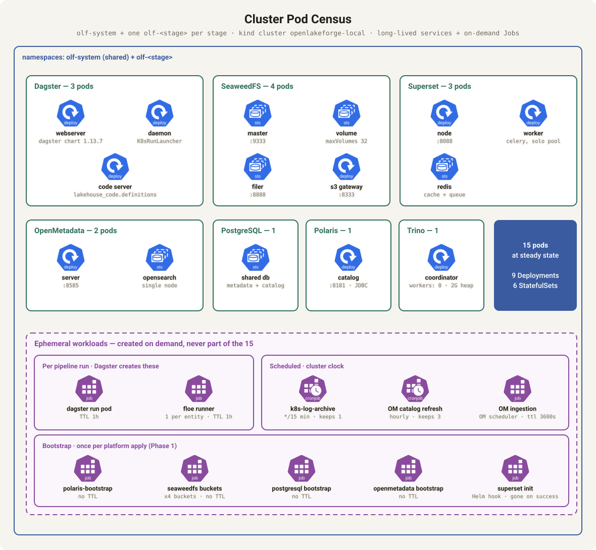
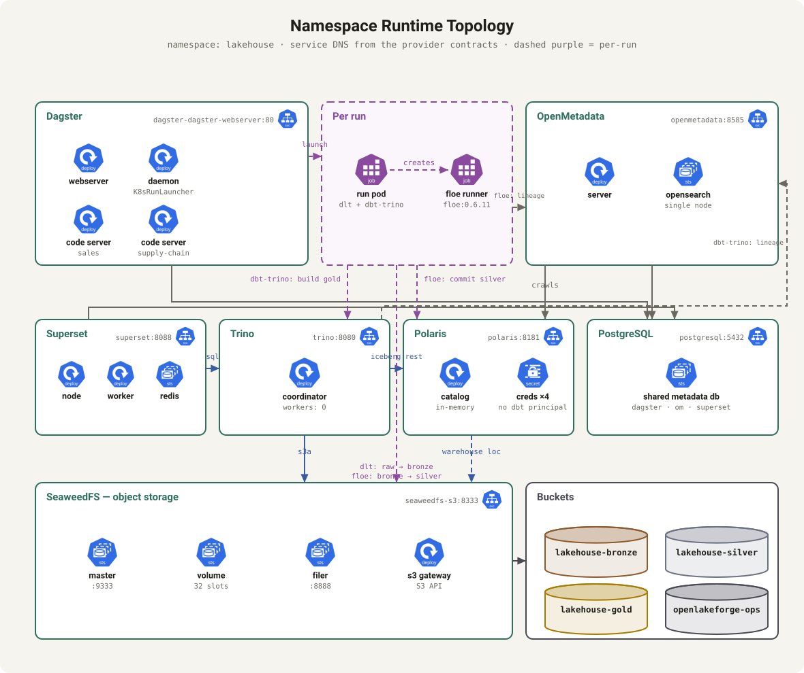
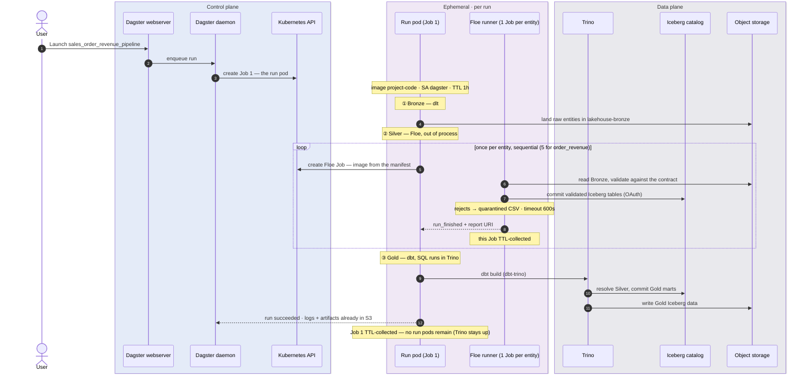
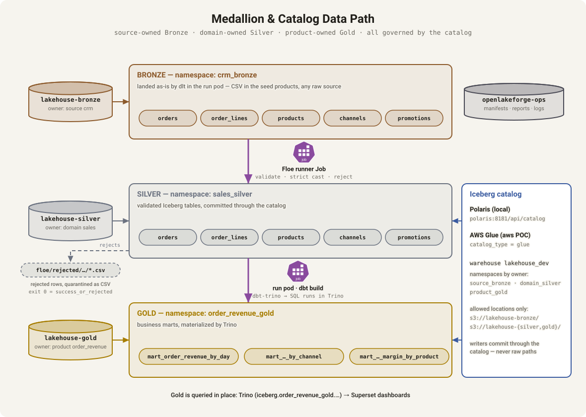
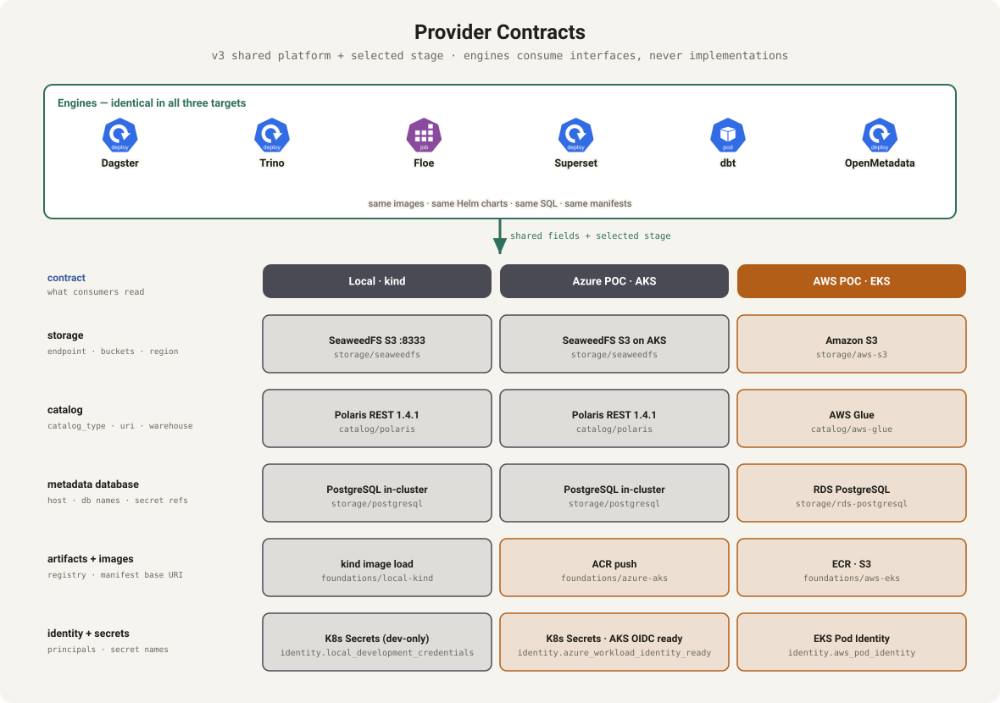

# OpenLakeForge — Architecture Charts

*How the platform is actually built, and how it actually runs — drawn the way Kubernetes
projects draw themselves.*

A cloud-agnostic, self-hostable lakehouse assembled on Kubernetes with Terraform and
Helm. Five charts in the official Kubernetes icon language: the pod-by-pod census, the
runtime wiring, the nested ephemeral jobs that do orchestration and ingestion (Bronze,
Silver — Gold executes as SQL in the long-lived Trino coordinator, not in a Job), the
medallion data path, and the provider contracts that make the platform modular. They
complement the product chart in
[../../assets/openlakeforge_v1.png](../../assets/openlakeforge_v1.png), which shows
*what* the platform does; these show *how*.

| **15** | **1+N** | **3** | **0** |
| --- | --- | --- | --- |
| pods at steady state — 9 Deployments, 6 StatefulSets | nested ephemeral Kubernetes Jobs per ingestion run — one run pod, one Floe Job per entity | deployment targets sharing one contract — kind, AKS, EKS | run/Floe pods between runs (Gold runs in Trino) |

### Reading key — used identically in every chart

| Signal | Means |
| --- | --- |
| Blue heptagon icon | Kubernetes workload — the badge names the kind (`deploy`, `sts`, `svc`, `secret`) |
| **Purple icon / dashed purple border** | **On-demand Job or CronJob** — created by something other than a Deployment, and never counted in the 15 |
| Green box | Long-lived service, grouped by Helm release |
| Blue box / badge | Control plane — Terraform, contracts, `olf` |
| Cylinder | Bucket or datastore; bronze / grey / amber follow the medallion layers |
| Orange | Managed service (AWS adapters) |

> Purple splits three ways by **what creates the Job**, which is also how chart 1 groups
> them. *Per pipeline run*: Dagster's `K8sRunLauncher` creates the run pod, which creates
> one Floe runner per entity — both TTL-collected within the hour, so the pipeline scales
> to zero between runs. *Bootstrap*: four Terraform `kubernetes_job_v1` resource blocks
> plus Superset's Helm hook — the SeaweedFS block uses `for_each` over four bucket names,
> so it alone creates four Jobs, for eight Jobs total, one shot per platform apply; the
> Helm hook is deleted on success and the rest persist until the next apply. *Scheduled*:
> two `kubernetes_cron_job_v1`
> resources on the cluster clock (log-archive every 15 min keeping 1 succeeded / 3 failed,
> OM catalog refresh hourly keeping 3 / 3), plus OpenMetadata's ingestion pipelines, which
> its own scheduler creates — not Terraform, and not Dagster.

---

## Chart 1 — Cluster Pod Census

*Every pod in the namespace, grouped by service — verified with `helm template` against
this repo's own values.*

Fifteen pods run at steady state: Dagster runs three (webserver, daemon, and the merged
`openlakeforge-dagster` code server loading `domains.definitions`), SeaweedFS runs four
(three StatefulSets and an S3-gateway Deployment), Superset runs three, OpenMetadata
runs two, and PostgreSQL, Polaris, and Trino run one each. Trino is deliberately
coordinator-only.

The purple band underneath is everything that is *not* in that 15, split by what creates
it. **Per pipeline run**: the run pod and its Floe runners, TTL-collected within the hour,
so ingestion scales to zero between runs — Gold is the exception, running as SQL inside
the long-lived Trino coordinator above rather than in a Job. **Bootstrap**: five grouped
categories — Polaris, SeaweedFS (one Job per bucket, four buckets), PostgreSQL,
OpenMetadata, and Superset's Helm hook — eight one-shot Jobs in total, firing once per
platform apply (Phase 1). **Scheduled**: the two CronJobs on the cluster clock
(log archive every 15 minutes, OpenMetadata catalog refresh hourly).



<sub>`infra/helm/values/local/*.yaml` · orchestration/dagster + storage/postgresql + governance/openmetadata Terraform modules</sub>

## Chart 2 — Namespace Runtime Topology

*What talks to what — the service DNS on the wires is what consumers actually read from
the contracts.*

Superset queries Trino; Trino resolves tables through Polaris and reads data over s3a;
Polaris persists catalog state in PostgreSQL through JDBC, so a plain pod restart
preserves catalog and table identity. Polaris points at the Iceberg warehouse files in
SeaweedFS; Dagster, OpenMetadata, Superset, and Polaris share one PostgreSQL service.
The per-run pair does the data work: the run pod lands raw data in
object storage with **dlt**, launches the **Floe** runner (which authenticates to
Polaris and reads/writes SeaweedFS), then calls **Trino** through dbt-trino to build
Gold. Both Floe and dbt-trino also push OpenLineage events straight to OpenMetadata's
native endpoint — that lineage ingestion was restored, not deferred.



<sub>[docs/architecture/local-stack-contracts.md](../local-stack-contracts.md) · `infra/terraform/modules/**`</sub>

## Chart 3 — Ephemeral Job Lifecycle

*Launch → run pod → one Floe Job per entity → Gold via Trino → everything garbage-collected.*

The differentiating behavior: the Dagster run pod is itself an ephemeral Job, and it
creates **one Floe runner Job per entity** — sequentially, from an image declared in the
Floe manifest, not in the Dagster deployment — so a product with five entities (e.g.
`order_revenue`) runs five distinct Floe Jobs over the course of one pipeline run, never
concurrently. Ingestion upgrades without rebuilding the orchestrator image; failures
isolate per entity; TTL returns the per-run footprint to zero (Gold SQL executes in the
standing Trino service, not a per-run pod).


```mermaid
sequenceDiagram
    autonumber
    actor User
    box rgb(228,235,248) Control plane
        participant UI as Dagster webserver
        participant Daemon as Dagster daemon
        participant API as Kubernetes API
    end
    box rgb(240,232,245) Ephemeral · per run
        participant Run as Run pod (Job 1)
        participant Floe as Floe runner (1 Job per entity)
    end
    box rgb(233,233,237) Data plane
        participant Trino
        participant Polaris as Iceberg catalog
        participant S3 as Object storage
    end

    User->>UI: Launch sales_order_revenue_pipeline
    UI->>Daemon: enqueue run
    Daemon->>API: create Job 1 — the run pod
    Note over Run: image project-code · SA dagster · TTL 1h

    Note over Run: ① Bronze — dlt
    Run->>S3: land raw entities in lakehouse-bronze

    Note over Run: ② Silver — Floe, out of process
    loop once per entity, sequential (5 for order_revenue)
        Run->>API: create Floe Job — image from the manifest
        Floe->>S3: read Bronze, validate against the contract
        Floe->>Polaris: commit validated Iceberg tables (OAuth)
        Note over Floe: rejects → quarantined CSV · timeout 600s
        Floe-->>Run: run_finished + report URI
        Note over Floe: this Job TTL-collected
    end

    Note over Run: ③ Gold — dbt, SQL runs in Trino
    Run->>Trino: dbt build (dbt-trino)
    Trino->>Polaris: resolve Silver, commit Gold marts
    Trino->>S3: write Gold Iceberg data

    Run-->>Daemon: run succeeded · logs + artifacts already in S3
    Note over Run: Job 1 TTL-collected — no run pods remain (Trino stays up)
```

> Observe it live: `kubectl -n lakehouse get jobs -w` — the run Job appears, then one
> Floe Job per entity while it is still Running, then all of them vanish an hour later.

Full detail — the per-engine execution table and the Job state machine — is in
**[chart3-ephemeral-job-lifecycle.md](chart3-ephemeral-job-lifecycle.md)**.

## Chart 4 — Medallion & Catalog Data Path

*Bucket = lane, and the Iceberg catalog governs Silver and Gold — one product traced end
to end.*

Raw data lands in Bronze as-is via dlt (CSV in the seed products, any raw source); the
Floe runner Job validates it against the contract and commits Silver Iceberg tables
through the catalog; dbt builds the Gold marts with the SQL executing **in Trino**
(dbt-trino). The catalog — Polaris locally, AWS Glue on the AWS POC — spans both curated
layers: per-product namespaces, allowed locations, and every write committed through it,
never to raw paths. Rejected rows are quarantined as CSV; exit code 0 covers
`success_or_rejected`.



<sub>environments/local/main.tf · catalog/polaris/main.tf · domains/sales/domain.yaml · ADR 0011, 0013</sub>

## Chart 5 — Provider Contracts

*Engines consume interfaces, never implementations — swap the adapters, keep the
engines.*

The modularity chart. The engines across the top are byte-identical in every deployment;
the five contracts below are what they actually depend on (endpoint, buckets,
`catalog_type`, secret names), and those stay stable across all three targets. Each cell
names the adapter and the Terraform source that selects it — because swapping a provider
means the environment's root instantiates a *different module*, not just a different
value in `contracts.tf`.

Cell colour is the argument: grey means the module is the same one `local` uses, orange
means it was swapped. **`azure-poc` instantiates the same seven platform modules as
`local`** — SeaweedFS, Polaris, PostgreSQL, Trino, OpenMetadata, Superset, Dagster all
reuse the identical modules — and `contracts.tf` pins that with a `check
"azure_poc_keeps_s3_compatible_storage"` block. But the foundation root (AKS vs kind),
artifact registry (ACR vs kind image load), and identity adapter (AKS OIDC-ready vs local
dev credentials) do differ from the foundation's perspective; since the matrix groups
artifacts and foundation together, two Azure cells appear orange. `aws-poc` swaps a
different set: exactly three platform modules (`storage/aws-s3`, `catalog/aws-glue`,
`storage/rds-postgresql`) and reuses Trino, OpenMetadata, Superset, Dagster.



<sub>`infra/terraform/environments/{local,aws-poc,azure-poc}/contracts.tf` · [provider-contracts.md](../provider-contracts.md) · ADR 0010, 0011, 0015, 0016</sub>

---

# Reference tables

*Comparisons and inventories — content that reads better as tables than as boxes.*

## Provider portability

| Contract | Local | Azure POC | AWS POC |
| --- | --- | --- | --- |
| Foundation | kind, 1 control-plane + 2 workers | AKS + ACR | VPC + EKS + node group + ECR |
| Object storage | SeaweedFS in-cluster | SeaweedFS on AKS | **S3** |
| Metadata database | PostgreSQL in-cluster | PostgreSQL in-cluster | **RDS PostgreSQL** |
| Iceberg catalog | Polaris REST | Polaris REST | **AWS Glue** |
| Container registry | kind image load | ACR | ECR |
| Workload identity | Kubernetes service account | AKS OIDC readiness | **EKS Pod Identity** — no static keys |
| Query + Gold engine | Trino | Trino | Trino |

`catalog_type` is the one field consumers branch on: `rest` selects the Polaris runtime
profile, `glue` the native Glue profile. Naming stays stable across Glue's two-level
model, so SQL and dbt models are unchanged. Not implemented (declared future adapters):
Keycloak, Vault/External Secrets, Traefik + cert-manager, Athena, Lake Formation, remote
Terraform state. OpenLineage is live, not deferred — Floe and dbt-trino emit lineage
events directly to OpenMetadata's native `openlineage` endpoint. The governance bootstrap
creates the endpoint credentials; runners receive them only through Secret references.
[ADR 0023](../../adr/0023-native-openlineage-emission-restored.md) supersedes ADR 0009's
engine-lineage deferral while retaining its rejection of a proxy and custom REST push.

## Foundation plus two-phase deploy — the CD boundary

Foundation work creates the cluster and registry. The deployment boundary itself has two
phases: static platform resources, then dynamic artifacts. A domain commit triggers the
artifact phase only — CI never runs Terraform for domain changes
([ADR 0008](../../adr/0008-two-phase-deploy-infra-and-artifacts.md),
[ADR 0017](../../adr/0017-shared-python-deploy-tooling.md)).

| Boundary | Target | Deploys |
| --- | --- | --- |
| Foundation (outside the deploy boundary) | `make local-foundation-up` | Terraform: the Kubernetes cluster + container registry — kind locally, EKS + ECR on AWS, AKS + ACR on Azure |
| Phase 1 — Platform | `make local-platform-up` | Terraform-managed platform resources: Helm releases for SeaweedFS, Polaris, Trino, OpenMetadata, Superset, Dagster — plus PostgreSQL, which Terraform creates directly as a StatefulSet + Service + bootstrap Job (no Helm release) |
| Phase 2 — Artifacts | `make local-artifacts-deploy` | **the CD phase** — dynamic artifacts: the project-code image (dbt code), Floe contracts + manifests, Superset dashboards, OpenMetadata data products |

`make local-up` chains foundation → Phase 1 → Phase 2; foundation and Phase 1 are
idempotent no-ops when nothing changed. Phase 2, in order: load contract env → compile
Floe manifests → build + load
`project-code` → `olf artifacts upload-manifests` → `olf superset deploy-reports` →
`olf openmetadata deploy-metadata` → `olf k8s set-project-code-image`, which patches
the run-launcher ConfigMap, every Dagster deployment, and the log-archive CronJob to
the new image before waiting on each rollout — not a bare `kubectl rollout restart`.
CI validates structure, infrastructure, contracts, project-code, tooling, dbt, and
release readiness; pull requests also run the bounded slim kind smoke.

## Identity — one principal per engine

| Principal | Secret | Roles |
| --- | --- | --- |
| trino | `polaris-trino-creds` | data-engineer / catalog-admin |
| floe | `polaris-floe-creds` | data-writer / catalog-writer |
| openmetadata | `polaris-om-creds` | data-reader / catalog-reader |
| (root) | `polaris-bootstrap-credentials` | bootstrap Job only |

dbt has **no** Polaris principal — the bootstrap deletes the old `polaris-dbt-creds`;
Gold SQL runs in Trino, so Gold catalog access uses `polaris-trino-creds`. Plus
`seaweedfs-s3-creds` for object storage. A leaked writer credential cannot
administer the catalog. Delivery is Terraform → Kubernetes Secret →
`envSecrets`/`envFrom` into long-lived pods *and* ephemeral Jobs; the Trino catalog file
holds `${ENV:...}` placeholders, never literal secrets. The AWS POC replaces static
storage keys entirely with EKS Pod Identity
([ADR 0016](../../adr/0016-aws-eks-pod-identity-over-irsa.md)).

## Observability — object storage is the sink

No Loki/Grafana/Prometheus in v1 (`observability.object_log_archive`). Ephemeral pods
are deleted on TTL; their evidence is not:

```text
s3://openlakeforge-ops/
├── floe/manifests/{domain}/{product}/                      ← olf artifacts upload-manifests
├── floe/reports/{domain}/{product}/                        ← ephemeral Floe runner Job
├── logs/dagster/compute/                                   ← S3ComputeLogManager
├── logs/k8s/namespace={ns}/date={YYYY-MM-DD}/hour={HH}/    ← log-archive CronJob
└── run-artifacts/dbt/{domain}/{product}/{dagster_run_id}/  ← run pod, post-dbt-build
```

Only the dbt run-artifacts are keyed by Dagster run ID (`run-artifacts/dbt/{domain}/
{product}/{dagster_run_id}/`), so those are isolable per run after the pod is gone. Floe's
`report_base_uri` (set per manifest, e.g. `floe/reports/sales/order_revenue`) stops at
domain and product — successive runs of the same product overwrite the same prefix, since
the runner's `base_args` carry no `--run-id`. The archived Kubernetes pod logs are
partitioned only by namespace / date / hour (`libs/k8s_log_archive.py`), so isolating a
single run from raw pod logs or from prior Floe reports needs a timestamp, not just a
prefix.

## Domain-oriented code structure — the dynamic code

Everything in Phase ③ is **domain code**: a domain owns one self-contained vertical slice
per data product — extract, contract, transformations, pipeline, dashboards, and
governance — and nothing about the platform changes when a product is added. This is the
"dynamic" half of the platform (the artifacts phase); the charts above are the static
half. Each concern maps to exactly one engine:

```text
domains/<domain>/
├── domain.yaml                         ← governance:      domain · data-product · medallion metadata → OpenMetadata
├── definitions.py                      ← pipeline entry:   the Dagster Definitions the code server loads
├── contracts/floe/
│   ├── <product>.yml                   ← contract:         Bronze→Silver schema · PK · reject policy    → Floe
│   └── manifests/<product>.manifest.json                   compiled, checksummed runner spec (baked + published)
├── extract/dlt/<product>.py            ← extract:          raw source → Bronze                          → dlt
├── transformations/dbt/<product>/      ← transformations:  Silver→Gold SQL                              → dbt-trino → Trino
│   └── models/gold/*.sql · sources.yml · schema.yml
├── pipelines/dagster/<product>.py      ← pipeline:         asset graph wiring bronze→floe→dbt           → Dagster
├── reports/superset/<product>/         ← dashboards:       charts · dashboards · datasets · databases   → Superset
│   └── metadata.yaml
└── examples/raw/<product>/*.csv                            seed data for the local demo
```

Both domains fill the identical shape — `sales` (`order_revenue`, `customer_health`) and
`supply_chain` (`inventory_reliability`). Adding a data product changes only its domain
slice, then runs the artifact phase. `olf catalog sync-namespaces` derives the Silver and
Gold namespaces from `domain.yaml` and reconciles them before Floe, dbt, or OpenMetadata
use them. A new product or domain therefore needs no environment Terraform edit or
platform apply; see ADR 0022. A domain's `README.md` and `domain.yaml` are the human- and
machine-readable descriptors of that slice.

---

**About these charts.** Charts 1, 2, 4, 5 are self-contained SVGs (official CNCF
Kubernetes icons embedded, no external references) generated by the Python sources in
[src/](src/) — regenerate with `python3 src/spec_chartN.py`. Chart 3 is a Mermaid
sequence diagram rendered natively by GitHub. Every count and identifier is traceable to
a cited source file; nothing aspirational is drawn as existing.
