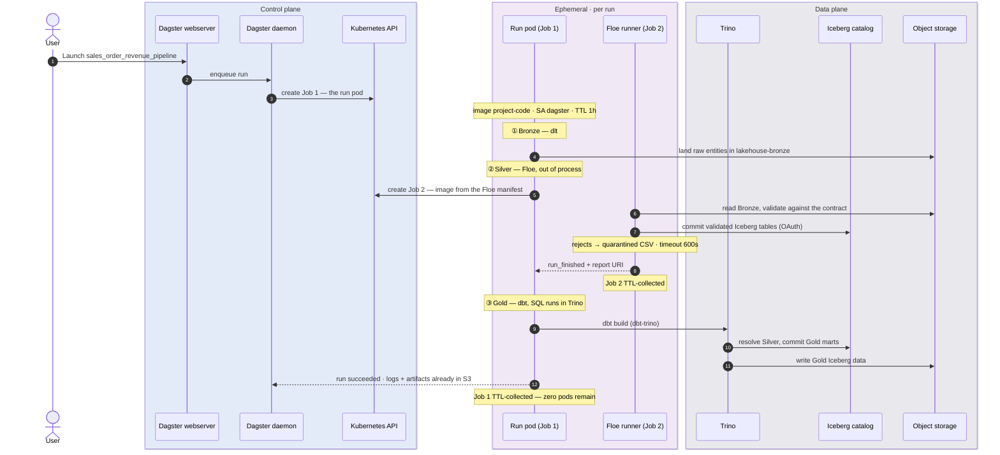
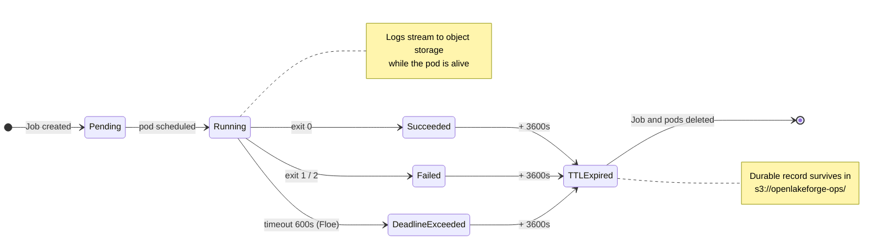

# Chart 3 — Ephemeral Kubernetes Job Lifecycle

**No data work runs in a long-lived pod.** Clicking *Launch* on a Dagster job creates an
ephemeral Kubernetes Job, and that Job's pod *itself* creates a second ephemeral Job for
Floe — from a container image declared inside the Floe manifest rather than in the
Dagster deployment. Both are garbage-collected on TTL. Between runs, the data-plane
compute footprint of the platform is zero.

The consequences: the ingestion engine upgrades without rebuilding the orchestrator
image, a failing entity cannot poison a shared worker, and resource limits are per-run
rather than per-cluster.

## The run



The exact values live in the manifest and the Terraform module: both Jobs use
`ttlSecondsAfterFinished: 3600` and ServiceAccount `dagster`; the Floe runner is
`ghcr.io/malon64/floe:0.6.8` with `timeout_seconds: 600`, polled every 5s; exit codes are
`0 = success_or_rejected`, `1 = technical_failure`, `2 = aborted`; and the run pod
carries the ~40 contract-derived environment variables plus `envFrom` secrets.

## Where each engine does its work

| | Floe (Silver) | dbt (Gold) |
| --- | --- | --- |
| Orchestrated from | The run pod | The run pod |
| Executes in | **Its own Kubernetes Job** | **Trino** — dbt-trino pushes the SQL down |
| Image | `ghcr.io/malon64/floe:0.6.8` — declared in the manifest | `project-code` runs the dbt CLI |
| Upgrade path | Regenerate the manifest; no image rebuild | Bump dbt in `project-code`; Trino via Helm |
| Storage access | S3 directly + catalog commits | Trino reads/writes S3; the run pod touches no data |
| Credentials | `polaris-floe-creds` | `polaris-dbt-creds` (Trino holds `polaris-trino-creds`) |

Floe brings its own runtime image and is invoked through a declared contract; dbt is a
thin client in the run pod whose transformations execute inside Trino — the run pod
never holds Gold data in memory (PR #62 replaced the earlier DuckDB materialization).

## Job lifecycle

`ttlSecondsAfterFinished` keeps completed Jobs from accumulating: Kubernetes deletes the
Job and its pods an hour after they reach a terminal state, leaving the logs and reports
already written to object storage as the durable record.



## Observing it live

```sh
kubectl --context kind-openlakeforge-local -n lakehouse get jobs -w
```

A `dagster-run-<id>` Job appears first, then one Floe runner Job per entity while the
run pod is still `Running`, then all of them disappear an hour after completion.

## Source of truth

- [libs/product_dagster.py](../../../libs/product_dagster.py) — asset graph assembly, Floe manifest resolution
- [domains/sales/contracts/floe/manifests/order_revenue.manifest.json](../../../domains/sales/contracts/floe/manifests/order_revenue.manifest.json) — runner spec (image, TTL, timeout, secrets), exit-code contract
- [infra/terraform/modules/orchestration/dagster/main.tf](../../../infra/terraform/modules/orchestration/dagster/main.tf) — `K8sRunLauncher`, `ttlSecondsAfterFinished`, runtime env
- [libs/dbt/profiles/](../../../libs/dbt/profiles/) — dbt targets (`type: trino` since PR #62)
- [ADR 0003](../../adr/0003-local-dagster-project-code-runtime.md), [ADR 0004](../../adr/0004-manifest-first-floe-sales-ingestion.md), [ADR 0005](../../adr/0005-dbt-duckdb-gold-on-dagster-kubernetes.md)
