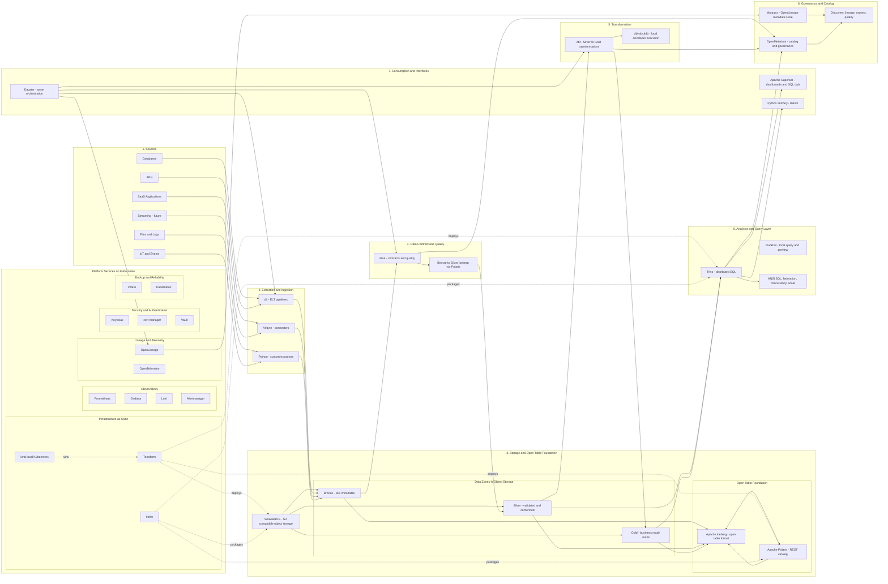

# OpenLakeForge v1 Architecture

This diagram is the editable Mermaid source of the current v1 target
architecture. It mirrors the original visual architecture reference in
`docs/assets/openlakeforge_archi.png`, while keeping the architecture in a
reviewable text format.

The complete Mermaid source with styling classes is kept in
`openlakeforge-v1-architecture.mmd`.
